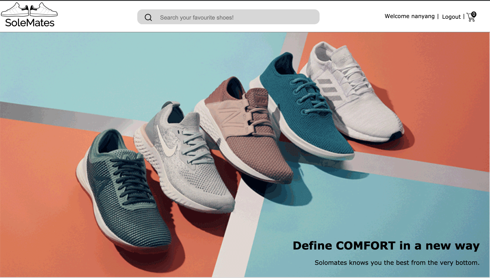
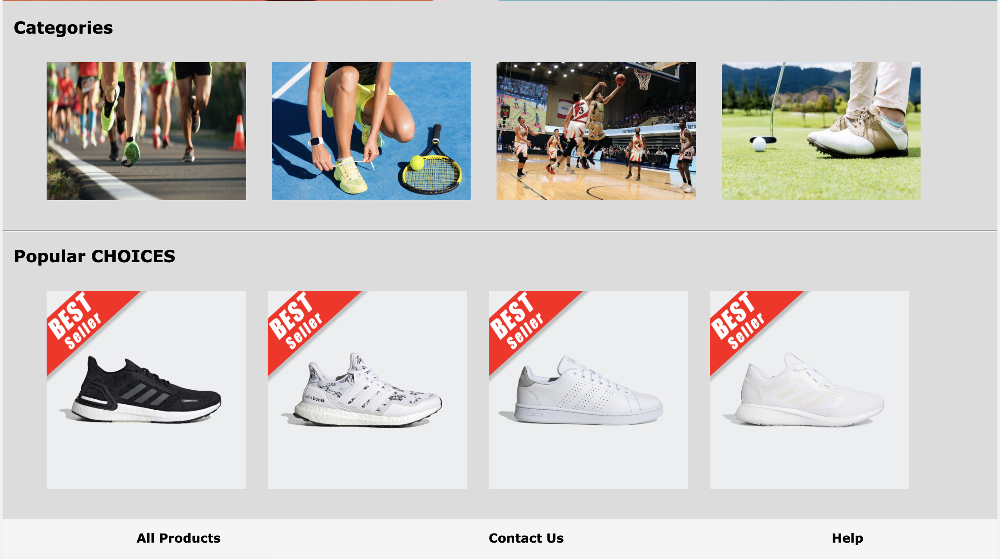
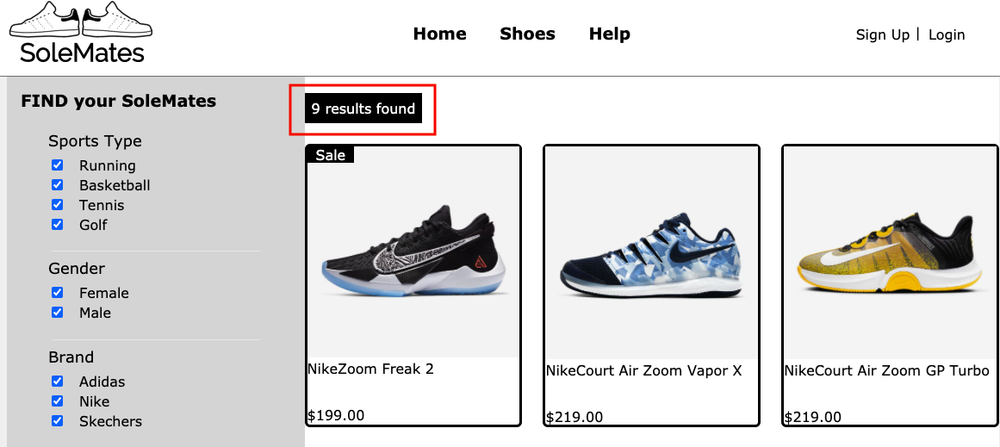
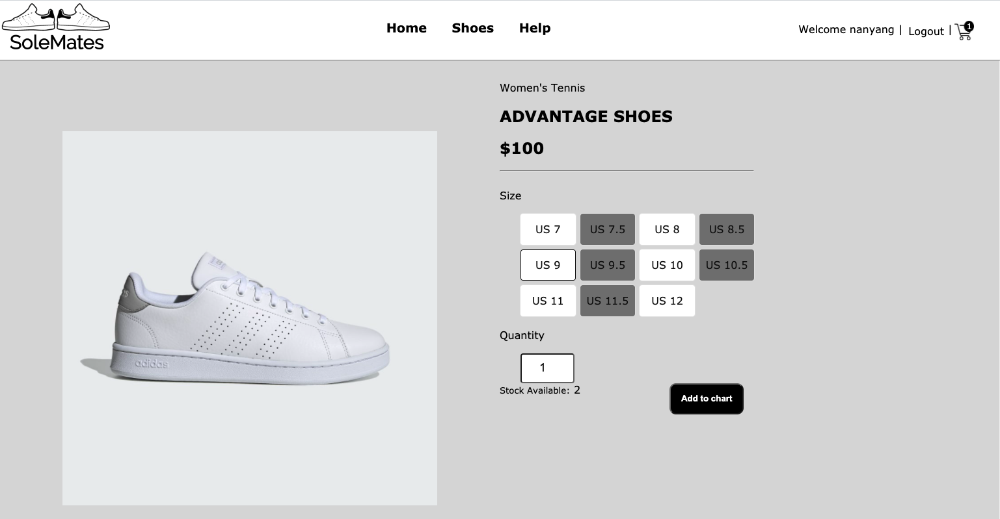
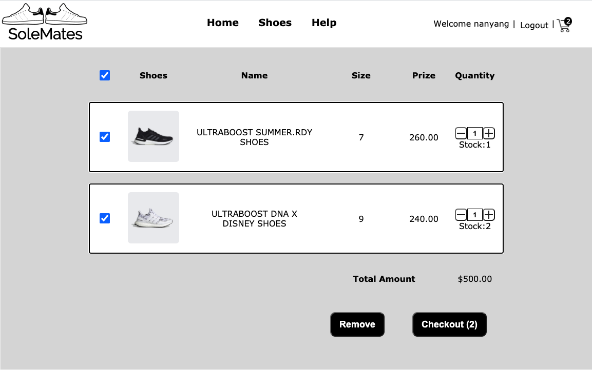
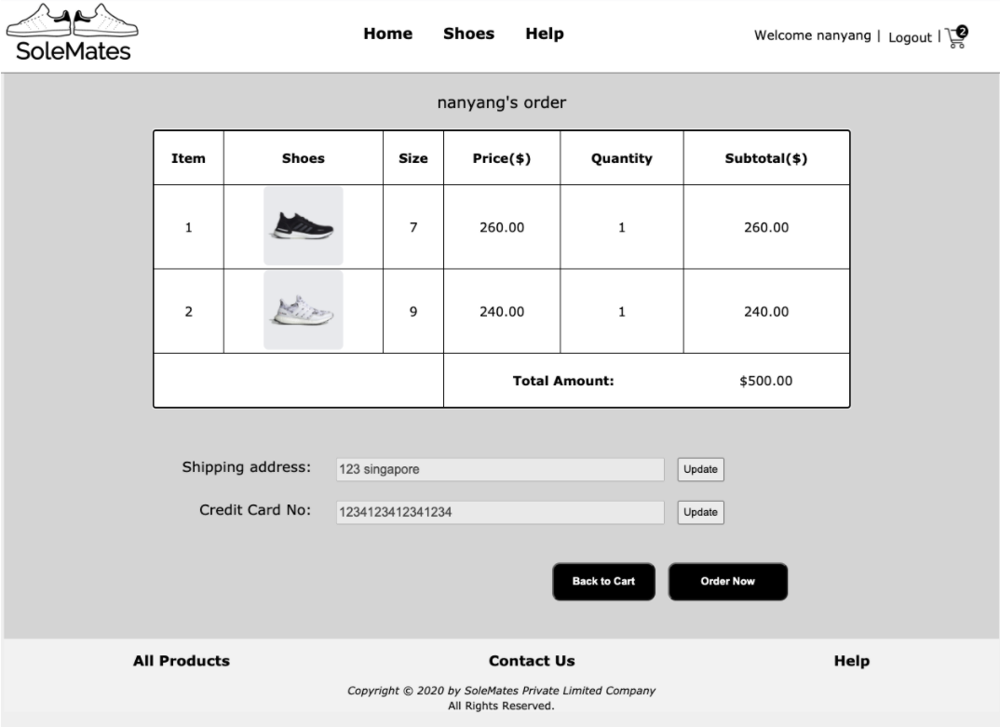
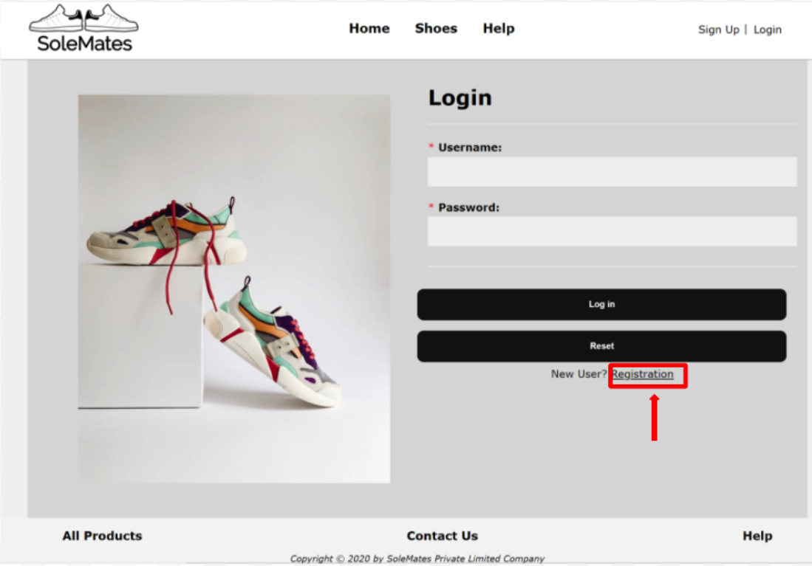
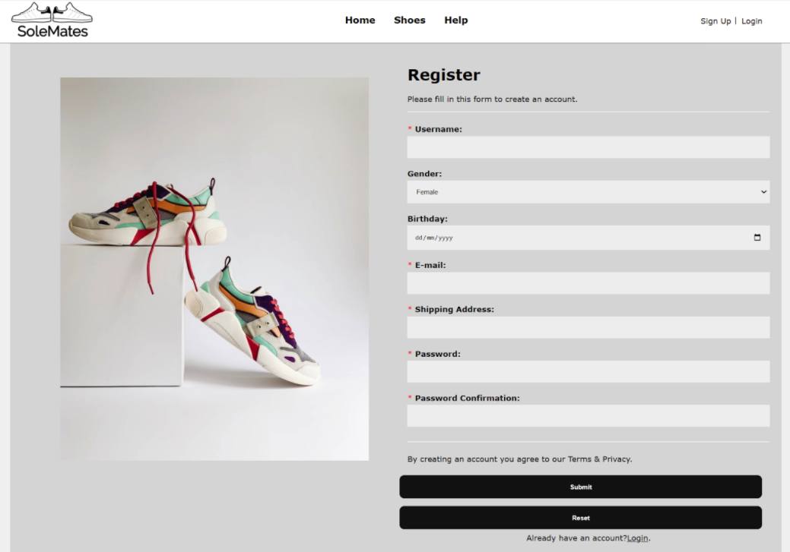
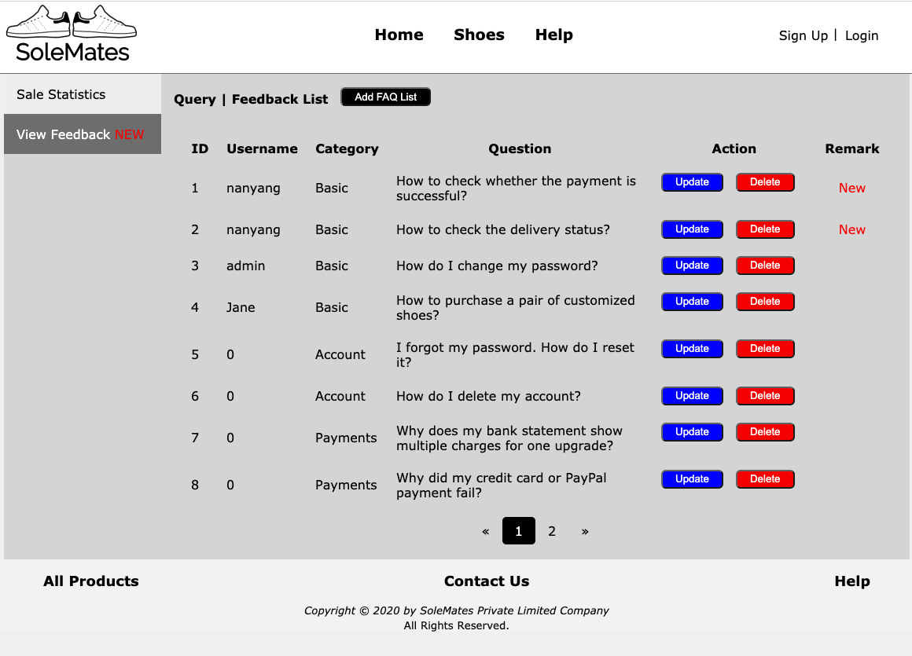

# SoleMates

This is a e-commerce WebApp project for sports shoes.

**Framework**

- Front-end

    HTML,CSS,JavaScript

- Back-end

    MySQL

- PHP used for dynamic webpages rendering and interface to query database

**Application features**

1. Allow members to login to the portal;
2. Allow potential buyers to register as a member of the sport shoes shop;
3. Allow potential buyers or registered members to browse through various sports shoes;
4. Allow registered members to add product(s) into shopping cart and then make purchase(s);
5. Allow registered members to view order confirmation of the selected items in shopping cart upon check out;
6. Allow registered members to submit queries and send feedback.
7. Allow admin users to view query sent from registered members, create, update and delete FAQ section

**Sitemap**
 

**Wireframe**
- Refer to the [Invision Page](https://jimmy928086.invisionapp.com/freehand/WebApp2-Y1OQYDVGl)

**Page display**

- Home page
    1. top part 
     
    
    2. bottom part
     
    

 
 
- Shopping page: Display product cards (image, name, price information)
 
  
- Product page: PHP query database, sizes with available stocks are clickable, user can add the order into cart.
 
       
     
- Shopping Cart page: Select products for checking out
 
  
                         
- Confirmation page: Key in shipping and payment details to confirm order.
 
  
      
- Login page
 
  

- Registration page
 
 

- Admin page: Used to manage the query, perform Update, Insert, Delete database query
 

